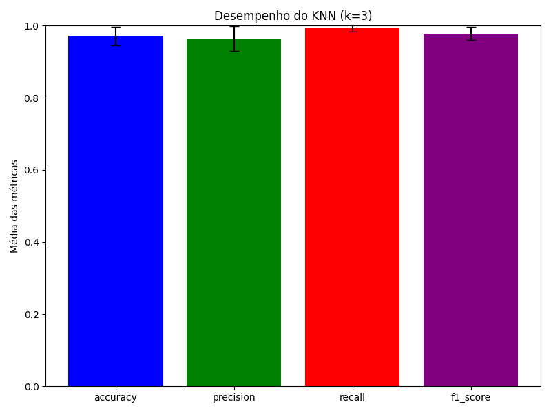

# Trabalho Final - Reconhecimento de Padrões  

**Instituto Federal do Ceará - Campus Maracanaú**  
**Disciplina:** Reconhecimento de Padrões  
**Professor:** Hericson Araújo  
**Aluno:** Francisco Aldenor Silva Neto  
**Matrícula:** 20221045050117  

## 1. Introdução  

Neste trabalho, aplicamos técnicas de aprendizagem de máquina para a classificação de tumores mamários usando o dataset **breastcancer.csv**. O objetivo é comparar o desempenho de dois modelos supervisionados: **K-Nearest Neighbors (KNN)** e **Árvore de Decisão**. A escolha desse problema se dá pela relevância da detecção precoce do câncer de mama, uma condição que, quando diagnosticada rapidamente, pode aumentar significativamente as chances de tratamento bem-sucedido.  

## 2. Fundamentação Teórica  

### 2.1 O Problema  
O câncer de mama é uma das principais causas de mortalidade entre mulheres. Técnicas de aprendizado de máquina podem auxiliar na classificação de tumores como **malignos** ou **benignos**, reduzindo erros humanos e aprimorando diagnósticos médicos.  

### 2.2 Descrição do Dataset  
O dataset **breastcancer.csv** contém diversas características extraídas de exames de imagens de células tumorais. Os atributos incluem medições estatísticas como **tamanho do núcleo**, **textura**, **simetria**, entre outros. A variável-alvo indica se um tumor é **benigno (B)** ou **maligno (M)**.  

### 2.3 Trabalhos Relacionados  
Diferentes estudos já aplicaram modelos como **SVM, Random Forest e Redes Neurais** na detecção do câncer de mama, obtendo altos índices de precisão. O presente trabalho explora **KNN e Árvore de Decisão** para avaliar sua viabilidade na tarefa.  

## 3. Metodologia  

Os seguintes passos foram realizados no desenvolvimento do projeto:  

1. **Pré-processamento dos Dados**:  
   - Normalização das variáveis para KNN.  
   - Conversão de classes categóricas em valores numéricos.  

2. **Divisão dos Dados**:  
   - Separação em treino (80%) e teste (20%).  
   - Validação cruzada para melhor generalização dos modelos.  

3. **Modelagem**:  
   - Implementação do **KNN** com k=3.  
   - Implementação da **Árvore de Decisão** ajustando hiperparâmetros.  

4. **Avaliação de Desempenho**:  
   - **Acurácia**, **Precisão**, **Recall** e **F1-score** foram usados para medir a qualidade dos modelos.  
   - Média e desvio-padrão das métricas calculadas após múltiplas execuções.  

## 4. Experimentos  

### 4.1 Resultados Obtidos  

#### **K-Nearest Neighbors (k=3)**  
- **Acurácia:** Média = 0.9714, Desvio Padrão = 0.0255  
- **Precisão:** Média = 0.9638, Desvio Padrão = 0.0341  
- **Recall:** Média = 0.9943, Desvio Padrão = 0.0114  
- **F1-score:** Média = 0.9785, Desvio Padrão = 0.0184  

##### **Gráfico das métricas do KNN**  
  

#### **Árvore de Decisão (Melhor Modelo)**  
- **Max Depth:** 4  
- **Min Samples Leaf:** 1  
- **Acurácia:** 0.9035  

##### **Curva Precision-Recall da Árvore de Decisão**  
  

##### **Curva ROC da Árvore de Decisão**  
  

### 4.2 Discussão  

O modelo **KNN (k=3)** apresentou **melhor desempenho** em todas as métricas quando comparado à Árvore de Decisão. Apesar disso, o KNN pode ser computacionalmente mais caro para grandes volumes de dados, pois a classificação depende da distância entre amostras no conjunto de treino. A **Árvore de Decisão**, por outro lado, tem um desempenho ligeiramente inferior, mas oferece uma estrutura interpretável e eficiente para decisões rápidas.  

As curvas **Precision-Recall** e **ROC** da Árvore de Decisão mostram que, embora a performance seja satisfatória, o modelo tem uma taxa de erro ligeiramente maior em relação ao KNN.  

## 5. Conclusão  

Neste trabalho, implementamos e avaliamos os modelos **KNN e Árvore de Decisão** para a classificação de tumores mamários. O **KNN** demonstrou melhor desempenho, alcançando uma acurácia média de **97,14%**, enquanto a **Árvore de Decisão** atingiu **90,35%**.  

Os gráficos incluídos reforçam a análise dos modelos, evidenciando que, embora ambos sejam viáveis para a tarefa, o **KNN** se destaca em precisão e recall, sendo uma melhor escolha para este dataset específico.